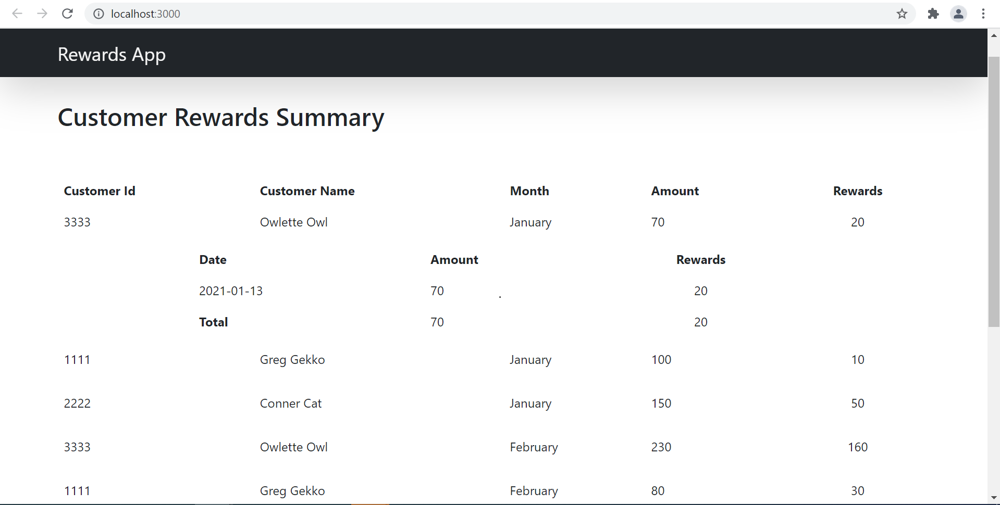

# Customer Rewards App

This app is a basic app for displaying Customer Rewards.

## Available Scripts

Download the Project, in the project directory, you can run:

### `npm install`

Installs the Dependencies.

### `npm start`

Runs the app in the development mode.\
Open [http://localhost:3000](http://localhost:3000) to view it in the browser.

## Page looks like below

